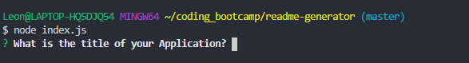

# README Generator

[Link to deployed GitHub App](https://github.com/Leon3005/readme-generator)

## Badge

## Description

The README generator prompts you with multiple questions that allows you to enter data for a README and saves you time by automatically generating the markup.

## Table of Contents

  - [Installation](#installation)
  - [Usage](#usage)
  - [Features](#features)
  - [Screenshots](#screenshots)
  - [License](#license)
  - [Credits](#credits)
  - [Tests](#tests)
  - [Contact](#contact)

## Installation

Run 'npm install' and run 'node index.js'

## Usage

Run 'node index.js' and answer the given prompts.

## Features

Generate a README file with pre-defined markup.

## Screenshots

## License

## Credits

Leon Wheeler

## Walkthrough Video

https://drive.google.com/file/d/1GmF2FWaymVOkz6d93wDb4CQY5JxxayQ8/view?usp=sharing

## Tests

No tests needed.

## Contact
For any issues, please contact [my email](mailto:leonwheeler08@gmail.com) 😀
